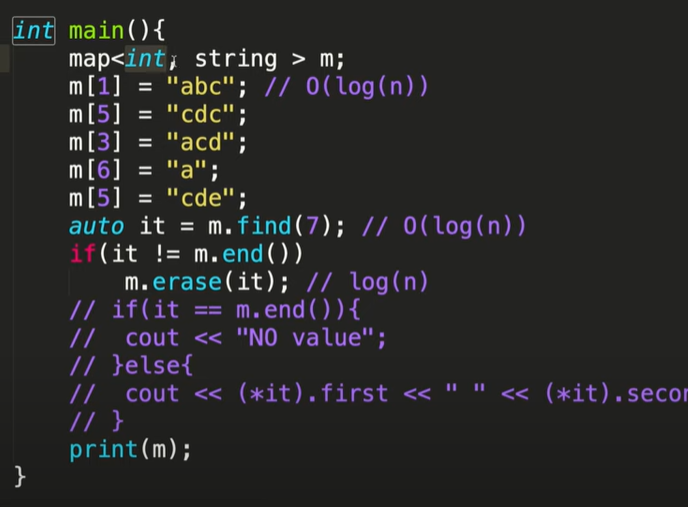

# Maps
-Maps are associative containers that store elements in a mapped fashion. Each element has a key value and a mapped value. No two mapped values can have the same key values.

### Types 
- Ordered maps 
- Unordered maps

## Syntax
- map<Datatype,Datatpye> name;
- map<int,int> mp;

## NOTE:
- insertion and acces in map take O(log n) time

